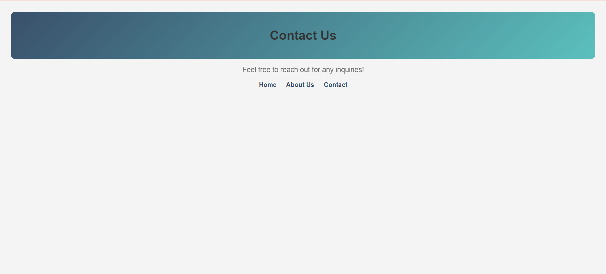
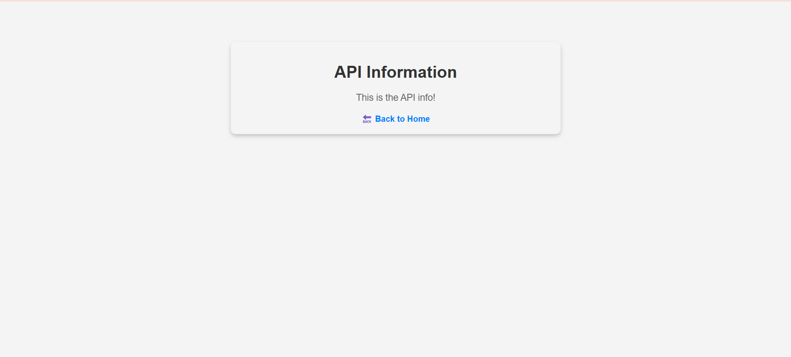
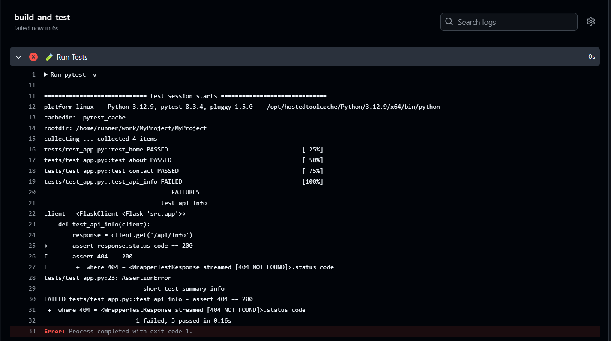

# **Project Report: Flask Web App with CI/CD and Testing**  

## **Project Overview**  
This project is a Flask-based web application with multiple pages, including a Home page, About Us page, Contact Us page, and an API endpoint. The project implements automated testing using `pytest` and a CI/CD pipeline via GitHub Actions.  

## **Screenshots and Explanations**  

### **1️⃣ Homepage**  
The homepage serves as the entry point of the application, providing a welcome message and navigation links.  

  

---

### **2️⃣ About Us Page**  
This page contains a brief description of the purpose of the web app.  

  

---

### **3️⃣ Contact Us Page**  
This page allows users to find ways to get in touch with the team.  

  

---

### **4️⃣ API Info Page**  
This page displays information about the API response. Initially, it was returning `{"message": "This is the API info!"}`, but it was later updated to match the expected response in the test case.  

  

---

## **Testing and Debugging**  

### **5️⃣ Running `pytest` - Successful Test Execution**  
After fixing the API response, all test cases passed successfully.  

✅ **Status:** All tests passed 🎉  

  

---

### **6️⃣ Initial API Test Failure**  
Before fixing the API response, the test for `/api/info` was failing because the expected message in the test case did not match the actual API response.  

❌ **Error:** Mismatched JSON response.  

  

---

### **7️⃣ GitHub Actions - Failed API Test Details**  
When GitHub Actions ran the tests, the API test failed. This screenshot shows the failure details in the GitHub Actions logs.  

  

---

### **8️⃣ GitHub Actions - Running Workflows**  
This screenshot shows GitHub Actions running the test workflow, ensuring continuous integration (CI) is working.  

  

---

## **Fixing Errors and Debugging**  

### **9️⃣ Fixing Pytest Installation Issues**  
Initially, `pytest` was not installed, causing errors when running tests. After installing `pytest` properly, the tests could be executed.  

  

---

### **🔟 Pytest Not Installed Error**  
This error occurred because `pytest` was not found in the system after installing it runs successfully. The solution was to install it using:  
```sh
pip install pytest
